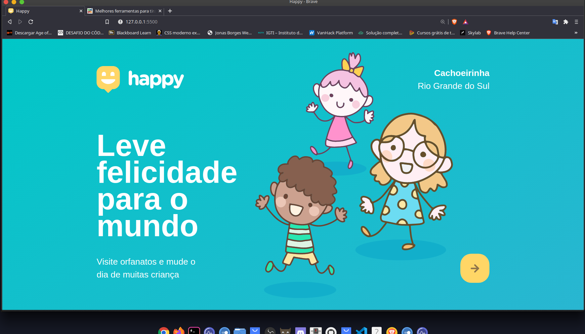
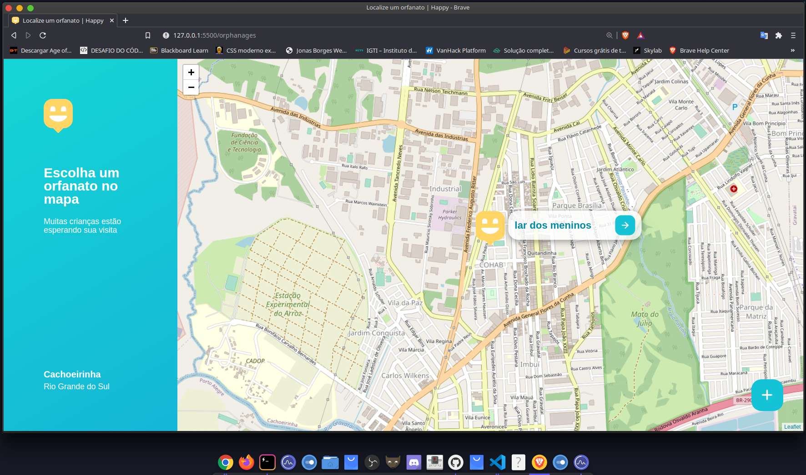
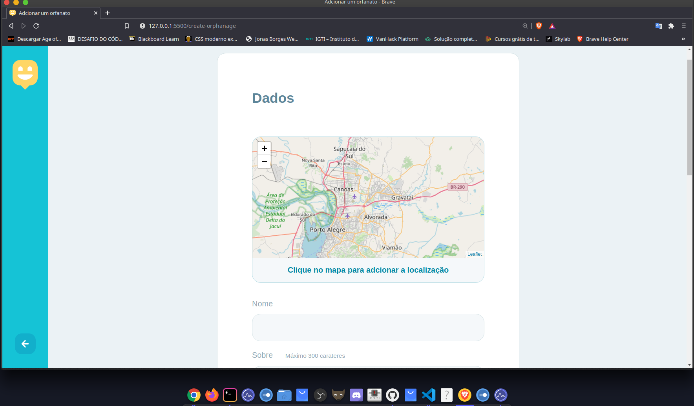

<p align="center">
  
<h1 align="center">Next Level Week 3 - Happy</h1>
  </p>

## Sobre o projeto :book:


O Happy é uma plataforma para localização e agendamento de visitas em lares de acolhimento de crianças. O Happy foi pensado em homenagem ao Dia das Crianças, com o intuito de trazer mais amor e carinho para crianças que vivem em situação de vulnerabilidade social.
<br>
O projeto foi desenvolvido durante a Next Level Week 3, organizada pela Rocketset. O evento aconteceu durante os dias 12 a 16 de Outubro de 2020. A trilha seguida foi a Discovered, ministrada pelo professor Mayk Brito.
<br>

## Preview ::computer:

  :heavy_check_mark: Layout responsivo para todos os tipos de aparelhos
  	<br>

 <p align="center">
  
    </p>
  
  
  ## Funcionalidades :gear:
  
  :heavy_check_mark: Visualizar os lares de adoção através do mapa da sua região
  <br>
   <p align="center">
    
  </p>
    <br>
   
   <br>
    :heavy_check_mark: Cadastrar um novo lar

   <p align="center">
      <br>
    
  </p>
  
 ## Tecnologias :hammer_and_wrench:
 - CSS3
 - HTML5
 - JavaScript
 - Handlebars
 - Node.js
 - Express
 - SQLite
 
 ## Como rodar no seu computador
 
 - Clone o repositório usando o Git Bash
 
 ```
$ git clone https://github.com/NatanSiilva/Happy.git

```

- Entre na pasta do projeto:

 ```
$ cd Happy
 ```

- Instale o NPM:
 ```
$ npm install
 ```
- Execute a aplicação:
 ```
$ npm start
 ```

- Abra o seu navegador com o seguinte link:
 ```
http://localhost:5500/
 ```

Desenvolvido 💜 By Natanael da Silva 